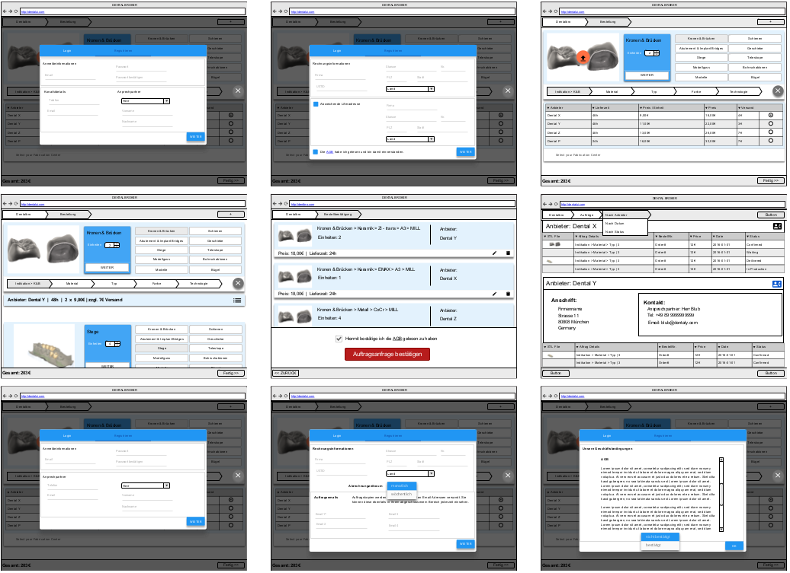

# Dental Broker

A market place for dental restorations

---

## Idea

Bring together dental labs and maufacturers.

- Simple
- Transparent
- Privacy

Make offers **compareable** and **billing** easy.

---

## Idea

---

### For CLIENTS this means

- Easy upload and product configuration
- Selecting your manufacturer by price / delivery / quality
- Easy payment
- Always be informed about the status of your orders
- History and control

---

### For PROVIDERS this means

- Easily adjust your portfolio
- Base price configuration
- Daily discounts
- Configurable notification
- Easy order confirmation & complete order data
- History and control

---

# Technically

Howto get the cake

- Specification
- Architecture
- Technologies
- Infrastructure

---

## Specification

- Wireframing
- Domain models

+++

### Wireframing

+++

### Model the Domain

- Tree based
- Automatic conversion
- Modification & compatible

+++

### Model the Domain: VISUAL

+++

### Model the Domain: XML

<< Code XML >>

+++

### Model the Domain: JSON

<< CODE JSON >>

---

## Architecture

- SPA with offline / sync capabilities
- API based communication
- SOA serverside
- Event based communication

+++

### Overview

<< Bild Frontend und services >>

+++

### Event based communication

<< Bild MQ >>

---

## Technologies

- Scaleable

+++

Client side

- Angular (Cordova & Electron)
- Magento as E-Commerce component

Server side

- Apache Kafka
- CouchDB
- One Database per Service (MongoDB, MYSQL)

---

# Infrastructure

- CI & CD via Jenkins
- Server provisioning via Docker Machine & Cloud hoster API
- Digital Ocean for production
- Strato for stage
- Docker Service containers
