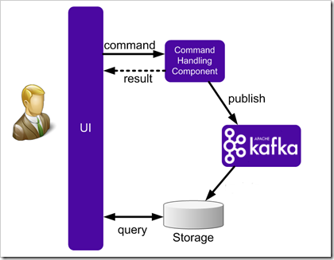

# Dental Broker

A market place for dental restorations

---

## Idea

Bring together dental labs and maufacturers.

- Simple
- Transparent
- Privacy

Make offers **compareable** and **billing** easy.

---

## Idea


---

### For CLIENTS this means

- Easy upload and product configuration
- Selecting your manufacturer by price / delivery / quality
- Easy payment
- Always be informed about the status of your orders
- History and control

---

### For PROVIDERS this means

- Easily adjust your portfolio
- Base price configuration
- Daily discounts
- Configurable notification
- Easy order confirmation & complete order data
- History and control

---

# Technically

How to get there

- Specification
- Architecture
- Technologies
- Infrastructure

---

## Specification

- Wireframing
- Domain models

+++

### Wireframing


+++

### Model the Domain

- Tree based
- Automatic conversion
- Modification & compatible


+++

### Model the Domain: VISUAL


+++

### Model the Domain: XML

```xml
<root>
   <children>
      <text>Inlay / Onlay / Veneer</text>
      <type>indication</type>
      <children>
         <text>Metall</text>
         <type>material</type>
         <children>
            <text>Gold</text>
            <type>materialType</type>
         </children>
      </children>
      <children>
         <text>Keramik</text>
         <colors>true</colors>
         <type>material</type>
         <children>
            <text>Glas / Feldspar</text>
            <type>materialType</type>
         </children>
         <children>
            <text>Lithium-Disilkat</text>
            <type>materialType</type>
         </children>
      </children>
   </children>
</root>
```

+++

### Model the Domain: JSON

```JSON
{
   "text": "Abutments & Implantbridges",
   "type": "indication",
   "children": [
      {
         "text": "Metall",
         "type": "material",
         "children": [
            {
               "text": "CoCr",
               "type": "materialType",
               "id": "materialtype-cocr"
            },
            {
               "text": "Titan",
               "type": "materialType",
               "id": "materialtype-titan"
            },
            {
               "text": "Gold",
               "type": "materialType",
               "id": "materialtype-gold"
            }
         ],
         "id": "material-metall"
      }
   ],
   "id": "indication-abutments-implantbridges"
}
```

---

## Architecture

- SPA with offline / sync capabilities
- API based communication
- SOA serverside
- Event based communication

+++

### Architecture requirements

- Scaleable
- Independently deployable services
- Extendable
- Techstack that fits the job

+++

### Overview


+++

### Event based communication



---

## Technologies

Client side

- Angular (Cordova & Electron)
- Magento as E-Commerce component
- JWT

+++

## Technologies

Server side

- Apache Kafka
- CouchDB, MongoDB, MYSQL
- Admesh & Blender

> One database per service

---

## Infrastructure

- CI & CD via Jenkins
- Server provisioning via Docker Machine & Cloud hoster API
- Digital Ocean for production
- Strato for stage
- Docker Service containers

---

## Service infrastructure

+++

### User Service

- Registration
- Token generation
- Userdata queries

+++

### Upload Service

- File uploads
- Storage
- STL analyzation
- HQ preview generation

+++

### Data Service

User specific data

- Orders query
- Orders download
 - Invoices
 - Shipping info
 - STL models
- Configuration per User
 - Portfolio
 - Prices & Discounts
 - Shipping configuration
 
+++

### Config Service

- Configuration tree queries
- Application configuration

+++

### Command Service

- Place orders
- Save configuration
- Accept/Decline orders
- Order status changes

+++

### Search Service

Keeps calculated prices for all users configuration & discounts

- Query by order configuration

+++

### Notification Service

Sends notification about events

- Emails for user registration
- Emails for incoming orders
- Frontend notification

+++

### E-Commerce Service

Provides E-Commerce functions

- Checkout process
- Payment information

Different containers per users country

---

## Implementation status

| Entity | Status |
| :-- | -:- |
| App | 70% |
| Upload Service | 80% |
| Command Service | 30% |
| Notification Service | 80% |
